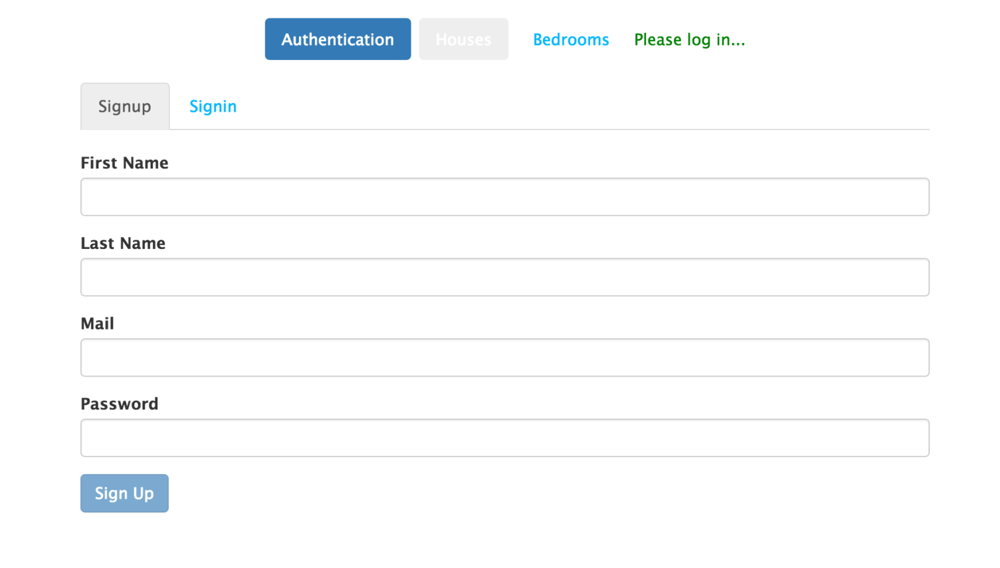
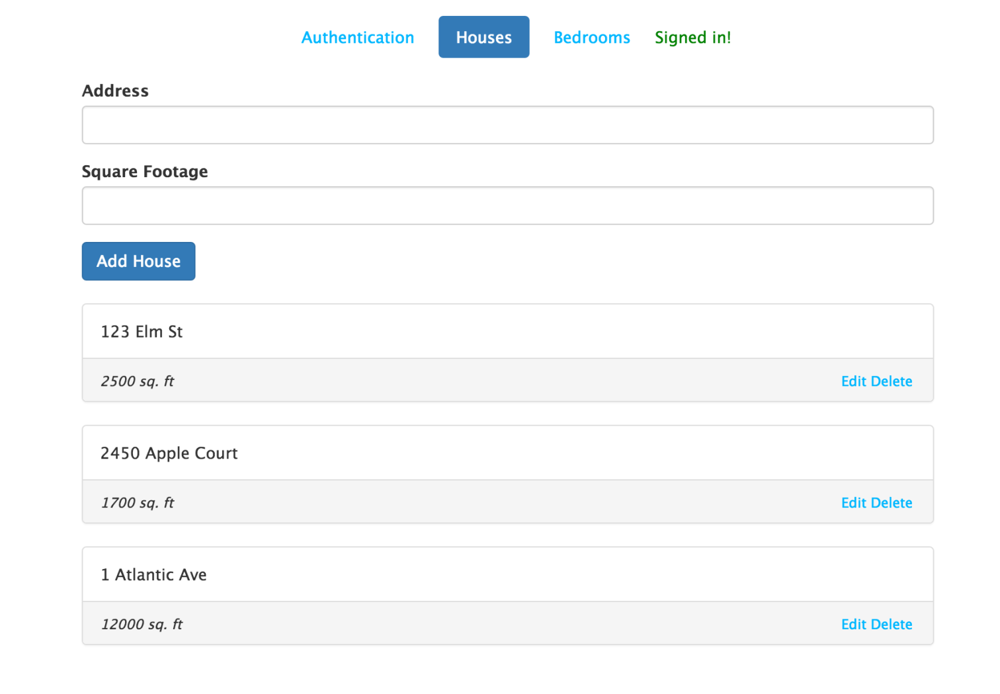
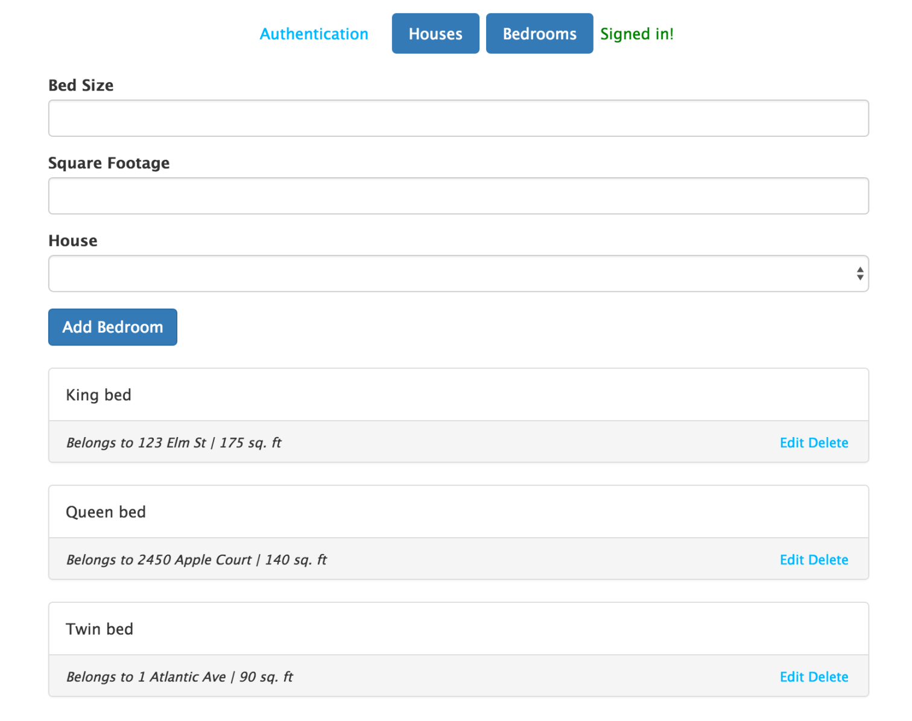

# CREATING A MEAN APPLICATION WITH AUTHENTICATION USING ANGULAR 2: Part 1

Today we are going to create a web application that uses Angular 2 and NodeJS/ExpressJS, along with MongoDB. You can expect the final application to look like this:





We have three types of domain objects in play: Users, Houses, and Bedrooms. Each of these objects have routes in our Node server and are persisted in MongoDB collections.

Let’s start by cloning this seed project: https://github.com/neelkrishna/Angular2-MEAN-Seed-Project. Looking at the project structure, you’ll see that there is a skeleton Node application set to listen on port 3000 (see bin/www) and a single route set to load the view “index” (routes/app.js). You’ll also notice within the assets folder, two .ts files. If you have any familiarity with Angular 2, you’ll know that this is a seed project for an Angular 2 app. For those unfamiliar with the .ts extension, it signifies a TypeScript file. TypeScript is a superscript of EcmaScript 6 (ES6). JavaScript is also known as ES5. For our purposes, TypeScript is a more powerful form of JavaScript that allows us to use constructors, instances of classes, and more comprehensive methods. The TypeScript tutorial I used was the one on angular.io, but you can probably follow along here without needing to visit a separate tutorial.

One other thing you’ll need to do before we start is installing mongoDB on your system. There are several resources online explaining how to do this, so I will not go into it. Once you have installed mongoDB create a database called node-angular. You can leave the mongod command running in the background while we turn our focus to the Node application. Make sure “mongoose” is required in app.js and set to connect to your database (usually on port 27017).

Let’s start by configuring our project to run on the browser. in your command line, navigate to the folder you have cloned the project into, and run the following commands in order:

```
npm run typings install
npm install gulp
npm run gulp
```

Then, in a new command tab navigate to the same folder and run: 

```npm start```

Navigate to `localhost:3000` in your browser and see the welcome message found in `views/index.hbs`. Note that the view is being called by `routes/app.js`, and that the angular app is not in the picture at all yet. For now, we’re going to keep it that way.

Let’s start by building the NodeJS server. The first thing we are going to do is create the **House** and **Bedroom** domain objects. Create a folder called `models` within the root project folder. Here is what your files should look like:

**models/house.js:**

```
var mongoose = require('mongoose');
var Schema = mongoose.Schema;
var bedroom = require('./bedroom');
var schema = new Schema({
	address: {type: String, required: true},
	sqFt: {type: String, required: true},
	bedroomIds:[{ 
		type: String, 
		ref:'bedroom' 
	}]
});
schema.plugin(mongooseUniqueValidator);
module.exports = mongoose.model('House', schema);
```

**models/bedroom.js:**

```
var mongoose = require('mongoose');
var Schema = mongoose.Schema;
var house = require('./house');
var schema = new Schema({
	bedSize: {type: String, required: true},
	sqFt: {type: String, required: true},
	houseId: { type:String}
});
module.exports = mongoose.model('Bedroom', schema);
```

Now that we have created these domain objects, Mongoose will know to persist them to collections in our node-angular database called house and bedroom.  The next thing we want to do is add routes for them – specifically to field HTTP requests from the browser.

**routes/houses.js:**

```
var express = require('express');
var router = express.Router();
var House = require('../models/house');
router.get('/', function(req, res, next){
    House.find()
        .exec(function(err, docs){
            if(err){
                return res.status(404).json({
                    title: 'An error occurred',
                    error: err
                });
            }
            res.status(200).json({
                message: 'Success',
                obj: docs
            });
        });
});
router.get('/:id', function(req, res, next){
    House.findById(req.params.id)
        .exec(function(err, doc){
            if(err){
                return res.status(404).json({
                    title: 'An error occurred',
                    error: err
                });
            }
            res.status(200).json({
                message: 'Success',
                obj: doc
            });
        });
});
router.post('/', function(req, res, next){
    var house = new House({
        address: req.body.address,
        sqFt: req.body.sqFt,
        bedroomIds: req.body.bedroomIds
    });
    house.save(function(err, result){
        if(err){
            return res.status(404).json({
                title: 'Error',
                error: err
            });
        }
        res.status(201).json({
            message: 'saved house',
            obj: result
        });
    });
});
router.patch('/:id', function(req, res, next){
    House.findById(req.params.id, function(err, doc){
        if(err){
            return res.status(404).json({
                title: 'Error',
                error: err
            });
        }
        if(!doc){
            return res.status(404).json({
                title: 'No house found',
                error: {message: 'House could not be found'}
            });
        }
        doc.address = req.body.address;
        doc.sqFt = req.body.sqFt;
        doc.bedroomIds = req.body.bedrooms
        doc.save(function(err, result){
            if(err){
                return res.status(404).json({
                    title: 'Error',
                    error: err
                });
            }
            res.status(200).json({
                message: 'Success',
                obj: result
            });
        });
    })
});
router.delete('/:id', function (req, res, next) {
    House.findById(req.params.id, function (err, doc) {
        if (err) {
            return res.status(404).json({
                title: 'An error occurred',
                error: err
            });
        }
        if (!doc) {
            return res.status(404).json({
                title: 'No houses found',
                error: {message: 'House could not be found'}
            });
        }
        doc.remove(function (err, result) {
            if (err) {
                return res.status(404).json({
                    title: 'An error occurred',
                    error: err
                });
            }
            res.status(200).json({
                message: 'Success',
                obj: result
            });
        });
    });
});
module.exports = router;
```

**routes/bedrooms.js:**

```
var express = require('express');
var router = express.Router();
var Bedroom = require('../models/bedroom');
router.get('/', function(req, res, next){
    Bedroom.find()
        .exec(function(err, docs){
            if(err){
                return res.status(404).json({
                    title: 'An error occurred',
                    error: err
                });
            }
            res.status(200).json({
                message: 'Success',
                obj: docs
            });
        });
});
router.get('/:id', function(req, res, next){
    Bedroom.findById(req.params.id)
        .exec(function(err, doc){
            if(err){
                return res.status(404).json({
                    title: 'An error occurred',
                    error: err
                });
            }
            res.status(200).json({
                message: 'Success',
                obj: doc
            });
        });
});
router.post('/', function(req, res, next){
    var bedroom = new Bedroom({
        bedSize: req.body.bedSize,
        sqFt: req.body.sqFt,
        houseId: req.body.houseId
    });
    console.log(JSON.stringify(bedroom));
    bedroom.save(function(err, result){
        if(err){
            return res.status(404).json({
                title: 'Error',
                error: err
            });
        }
        res.status(201).json({
            message: 'saved bedroom',
            obj: result
        });
    });
});
router.patch('/:id', function(req, res, next){
    Bedroom.findById(req.params.id, function(err, doc){
        if(err){
            return res.status(404).json({
                title: 'Error',
                error: err
            });
        }
        if(!doc){
            return res.status(404).json({
                title: 'No bedroom found',
                error: {message: 'Bedroom could not be found'}
            });
        }
        doc.bedSize = req.body.bedSize;
        doc.sqFt = req.body.sqFt;
        doc.house = req.body.house;
        doc.save(function(err, result){
            if(err){
                return res.status(404).json({
                    title: 'Error',
                    error: err
                });
            }
            res.status(200).json({
                message: 'Success',
                obj: result
            });
        });
    })
});
router.delete('/:id', function (req, res, next) {
    Bedroom.findById(req.params.id, function (err, doc) {
        if (err) {
            return res.status(404).json({
                title: 'An error occurred',
                error: err
            });
        }
        if (!doc) {
            return res.status(404).json({
                title: 'No bedroom found',
                error: {message: 'Bedroom could not be found'}
            });
        }
        doc.remove(function (err, result) {
            if (err) {
                return res.status(404).json({
                    title: 'An error occurred',
                    error: err
                });
            }
            res.status(200).json({
                message: 'Success',
                obj: result
            });
        });
    });
});
module.exports = router;
```

The code for both of these files is similar so I posted them together. Notice the format for each request. If you are unfamiliar with it, as I was, the important thing to note is that each request takes in two parameters: a route, sometimes with additional parameters like ID, and a function. The function takes in `req`, `res`, and `next`. For our purposes, let’s focus on the req(uest) and the res(ponse). The request is passed as *JSON* from the browser and is acted on in these methods. Once the correct action is taken by the server, a JSON response is sent back to the browser conaining whatever is designated using the return keyword.

At this point, we should have what we need to handle HTTP requests from the browser, meaning we can shelf the server for now (until we are ready to add authentication) and start building the Angular 2 front-end project. Since we are writing a smaller application than most, I have integrated the client-side application and the server into one project. Larger endeavors will usually separate them into two; however, here you can find the starter files for the Angular app in the assets folder. We will build out the entirety of the client-side application in that folder.  Navigate to [part 2](./pages/mean_app_2). of this tutorial to continue.