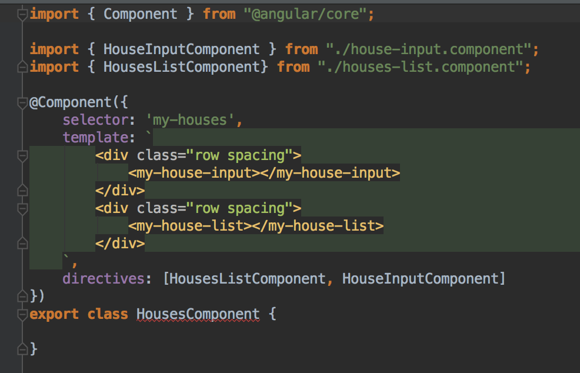
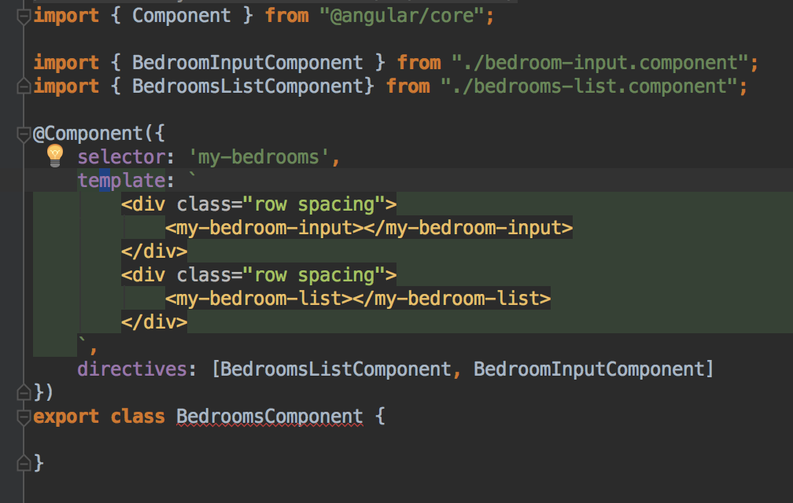

# CREATING A MEAN APPLICATION WITH AUTHENTICATION USING ANGULAR 2: Part 2

Welcome to part 2 of this tutorial! In this part, we'll get started on the Angular app.  If you missed part 1, check it out [here.](/pages/mean_app_2)

Let’s start by creating a simple house object. Within the assets/app folder, create a new folder called houses, and within that a new file called **house.ts:**

```
export class House {
    address: string;
    sqFt: string;
    bedroomIds: string[];
    houseId: string;

    constructor (address: string, sqFt: string, bedroomIds?: string[], houseId?: string) {
        this.address = address;
        this.sqFt = sqFt;
        this.bedroomIds = bedroomIds;
        this.houseId = houseId;
    }
}
```

And, let’s also create a folder called bedrooms on the same level as houses, and add **bedroom.ts:**

```
export class Bedroom {
    bedSize: string;
    sqFt: string;
    houseId: string;
    bedroomId: string;

    constructor (bedSize: string, sqFt: string, houseId: string, bedroomId: string) {
        this.bedSize = bedSize;
        this.sqFt = sqFt;
        this.houseId = houseId;
        this.bedroomId = bedroomId;
    }
}
```

We have just created two angular 2 domain objects, and now we must define components for them. To try to picture what we are attempting with this step, look back at the screenshots of the finished app at the top of the tutorial. We are about to create the html and TypeScript methods for each of the House and Bedroom objects shown in a list in the second and third screenshots. 

Here is the code for **houses/house.component.ts:**

```
import { Component, Input, Output, EventEmitter } from "@angular/core";

import { House } from "./house";
import { HouseService } from "./house.service";
```


```
export class HouseComponent {
    @Input() house:House;
    @Output() editClicked = new EventEmitter();

    constructor (private _houseService: HouseService, private _errorService: ErrorService) {}

    onEdit() {
        this._houseService.editHouse(this.house);
    }

    onDelete() {
        this._houseService.deleteHouse(this.house)
            .subscribe(
                data => console.log(data),
                error => this._errorService.handleError(error)
            );
    }
}
```

Here is the corresponding code for **bedrooms/bedroom.component.ts:**

```
import { Component, Input, Output, EventEmitter } from "@angular/core";

import { Bedroom } from "./bedroom";
import { BedroomService } from "./bedroom.service";
import { HouseService } from "../houses/house.service";
import { ErrorService } from "../errors/error.service";
```


```
export class BedroomComponent {
    @Input() bedroom:Bedroom;
    @Output() editClicked = new EventEmitter();
    houseAddress : string;

    constructor (private _bedroomService: BedroomService, private _houseService: HouseService, private _errorService: ErrorService) {}

    ngOnInit(){
        if(this.bedroom.houseId){
            this._houseService.getHouseAddress(this.bedroom.houseId)
                .subscribe(
                    data => this.houseAddress = data,
                    error => this._errorService.handleError(error)
                );
        }

    }

    onEdit() {
        this._bedroomService.editBedroom(this.bedroom);
    }

    onDelete() {
        this._bedroomService.deleteBedroom(this.bedroom)
            .subscribe(
                data => console.log(data),
                error => this._errorService.handleError(error)
            );
    }
}
```

You should notice that these two classes call two service classes that we have not created yet: **HouseService** and **BedroomService**. Without them, the application will naturally crash. Before we begin working on those methods, though, we first need to draw our attention to Angular 2’s newest, proudest feature: Observables. Observables have replaced promises from angularjs. They are special TypeScript objects that notify “subscribers” of changes to the object. For instance, our array of houses can be changed through adding, editing, or deleting entries. Since the array of houses returned through the service (which we are about to create) is an Observable, we can subscribe to it in the component as you see in the onDelete method of each component. So, with that in mind, let’s build our service classes. 

Here is **houses/house.service.ts:**

```
import { House } from "./house";
import {Http, Headers} from "@angular/http";
import {Injectable, EventEmitter} from "@angular/core";
import 'rxjs/Rx';
import {Observable} from "rxjs/Observable";

@Injectable()
export class HouseService {
    houses:House[] = [];
    editClicked = new EventEmitter();

    constructor(private _http:Http) {
    }

    addHouse(house: House){
        const body = JSON.stringify(house);
        const headers = new Headers({'Content-Type': 'application/json'});
        return this._http.post('http://localhost:3000/house', body, {headers: headers})
            .map(response => {
                const data = response.json().obj;
                let house = new House(data.address, data.sqFt, data.bedrooms ? data.bedrooms : null, null);
                return house;
            })
            .catch(error => Observable.throw(error.json()));
    }

    getHouses(){
        return this._http.get('http://localhost:3000/house')
            .map(response => {
                const data = response.json().obj;
                let objs: any [] = [];
                for(let i = 0; i < data.length; i++){                     let house = new House(data[i].address, data[i].sqFt, data[i].bedrooms ? data[i].bedrooms : null, data[i]._id);                     objs.push(house);                 };                 return objs;             })             .catch(error => Observable.throw(error.json()));
    }

    getHouseAddress(houseId){
        return this._http.get('http://localhost:3000/house/' + houseId)
            .map(response => {
                const data = response.json().obj;
                return data.address;
            })
            .catch(error => Observable.throw(error.json()));
    }

    updateHouse(house: House){
        const body = JSON.stringify(house);
        const headers = new Headers({'Content-Type': 'application/json'});
        return this._http.patch('http://localhost:3000/house/' + house.houseId, body, {headers: headers})
            .map(response => response.json())
            .catch(error => Observable.throw(error.json()));
    }

    editHouse(house: House){
        this.editClicked.emit(house);
    }

    deleteHouse(house: House){
        this.houses.splice(this.houses.indexOf(house), 1);
        return this._http.delete('http://localhost:3000/house/' + house.houseId)
            .map(response => response.json())
            .catch(error => Observable.throw(error.json()));
    }
}
```

and here is **bedrooms/bedroom.service.ts:**

```
import { Bedroom } from "./bedroom";
import {Http, Headers} from "@angular/http";
import {Injectable, EventEmitter} from "@angular/core";
import 'rxjs/Rx';
import {Observable} from "rxjs/Observable";

@Injectable()
export class BedroomService {
    bedrooms:Bedroom[] = [];
    editClicked = new EventEmitter();

    constructor(private _http:Http) {
    }

    addBedroom(bedroom: Bedroom){
        const body = JSON.stringify(bedroom);
        const headers = new Headers({'Content-Type': 'application/json'});
        return this._http.post('http://localhost:3000/bedroom', body, {headers: headers})
            .map(response => {
                const data = response.json().obj;
                let bedroom = new Bedroom(data.bedSize, data.sqFt, data.houseId, null);
                return bedroom;
            })
            .catch(error => Observable.throw(error.json()));
    }

    getBedrooms(){
        return this._http.get('http://localhost:3000/bedroom')
            .map(response => {
                const data = response.json().obj;
                let objs: any [] = [];
                for(let i = 0; i < data.length; i++){                     let bedroom = new Bedroom(data[i].bedSize, data[i].sqFt, data[i].houseId, data[i]._id);                     objs.push(bedroom);                 };                 return objs;             })             .catch(error => Observable.throw(error.json()));
    }

    updateBedroom(bedroom: Bedroom){
        const body = JSON.stringify(bedroom);
        const headers = new Headers({'Content-Type': 'application/json'});
        return this._http.patch('http://localhost:3000/bedroom/' + bedroom.bedroomId, body, {headers: headers})
            .map(response => response.json())
            .catch(error => Observable.throw(error.json()));
    }

    editBedroom(bedroom: Bedroom){
        this.editClicked.emit(bedroom);
    }

    deleteBedroom(bedroom: Bedroom){
        this.bedrooms.splice(this.bedrooms.indexOf(bedroom), 1);
        return this._http.delete('http://localhost:3000/bedroom/' + bedroom.bedroomId)
            .map(response => response.json())
            .catch(error => Observable.throw(error.json()));
    }
}
```

Notice in each method, the HTTP request is appended with a *.map()* call, which sets the response passed back from the server (recall that this is sent back in JSON format and usually contains the object passed in the request with either an error or success message). Other notes about these service methods:

1. in both the add methods, notice that the response is received and the object it returns is added to the array of houses or bedrooms initialized at the top of the service.
2. in the delete methods, the splice method is just making sure that the deleted item is removed from the view without a refresh. The next line, with the HTTP request, makes sure it is wiped from the database as well.
3. the edit methods are simply populating the textboxes at the top with the proper information once edit within the component is clicked. The update methods are what are evoked when the edit button is pressed under the textboxes. To picture this, see the screenshots at the start of this piece.
4. Observables have to be imported from the Rxjs library.

Now that we have created a house component and bedroom component, we have to add a way for users to create house and bedroom entries. 

Here is the code for **houses/house-input.component.ts:**

```
import { Component, OnInit } from "@angular/core";

import { House } from "./house";
import { Bedroom } from "../bedrooms/bedroom";
import { BedroomService } from "../bedrooms/bedroom.service";
import { HouseService } from "./house.service";
import 'rxjs/Rx';
import {Observable} from "rxjs/Observable";
```


```
export class HouseInputComponent implements OnInit{
    house:House = null;
    bedroomList:Bedroom[] = null;
    constructor(private _houseService:HouseService, private _bedroomService:BedroomService) {
    }

    onSubmit(form:any) {

        if(this.house){
            this.house.address = form.address;
            this.house.sqFt = form.sqFt;
            this.house.bedroomIds = form.bedrooms;
            this._houseService.updateHouse(this.house)
                .subscribe(
                    data => console.log(data),
                    error => console.log(error)
                );
            this.house = null;
        }else{
            const house:House = new House(form.address, form.sqFt, form.bedrooms, null);
            this._houseService.addHouse(house)
                .subscribe(
                    data => {
                        console.log(data);
                        this._houseService.houses.push(data);
                    },
                    error => console.log(error)
                );
        }

    }

    onCancel(){
        this.house = null;
    }

    ngOnInit(){
        this._houseService.editClicked.subscribe(
            house => {
                this.house = house;
            }
        );
    }
}
```

The code for **bedrooms/bedroom-input.component.ts:**

```
import { Component, OnInit } from "@angular/core";

import { Bedroom } from "./bedroom";
import { House } from "../houses/house";
import { BedroomService } from "./bedroom.service";
import { HouseService } from "../houses/house.service";
```


```
export class BedroomInputComponent implements OnInit{
    bedroom:Bedroom = null;
    houseList:House[] = null;
    constructor(private _bedroomService:BedroomService, private _houseService:HouseService) {
    }

    onSubmit(form:any) {
        if(this.bedroom){
            this.bedroom.bedSize = form.bedSize;
            this.bedroom.sqFt = form.sqFt;
            this.bedroom.houseId = form.houseId;
            this._bedroomService.updateBedroom(this.bedroom)
                .subscribe(
                    data => console.log(data),
                    error => console.log(error)
                );
            this.bedroom = null;
        }else{
            const bedroom:Bedroom = new Bedroom(form.bedSize, form.sqFt, form.houseId, null);
            this._bedroomService.addBedroom(bedroom)
                .subscribe(
                    data => {
                        console.log(data);
                        this._bedroomService.bedrooms.push(data);
                    },
                    error => console.log(error)
                );
        }

    }

    onCancel(){
        this.bedroom = null;
    }

    ngOnInit(){
        this._bedroomService.editClicked.subscribe(
            bedroom => {
                this.bedroom = bedroom;
            }
        );


        this._houseService.getHouses()
            .subscribe(
                houses => {
                    this.houseList = houses;
                    this._houseService.houses.push(houses);
                }
            );

    }
}
```

So now, we have successfully created input fields with a button which calls the appropriate service method, as discussed in the four points below the service classes above. The last individual components we need to create for each of our domain objects are list components, and then one component to contain each of the others we have created. 

Let’s start with **houses/house-list.component.ts:**


And **bedrooms-list.component.ts:**


The notables for these files include the **ngFor** in the HTML template, which is used to iterate through and list each of the objects (notice the *my-bedroom* selector in **bedrooms-list.component.ts**, which belongs to **bedroom.component.ts**), as well as the subscribe method adding each bedroom or house to the premade array as it is received by the Observable object.

Finally, we have **houses.component.ts** and **bedrooms.component.ts**. These files put together the components we have created so far using selectors for those components:





Not much else to say about those files. The next task is to add a navigation bar from which we can switch between the houses page and bedrooms page. To do that we have to configure routes for those two pages. We will do this in the existing app.component.ts file, so that it looks like this:

```
import { Component } from '@angular/core';
import { Routes, ROUTER_DIRECTIVES, Router } from "@angular/router";
import { HeaderComponent } from "./header.component";
import { HousesComponent } from "./houses/houses.component";
import { BedroomsComponent } from "./bedrooms/bedrooms.component";
```


```
@Routes([
    {path: '/', component: HousesComponent},
    {path: '/bedrooms', component: BedroomsComponent},
])
export class AppComponent {
    
}
```

The important thing about this file is the routes section, where we have made the root route match our HousesComponent and added another route for our BedroomsComponent. Notice we are trying to import a HeaderComponent, which is something we haven’t created yet. Let’s do that now. 

Here is the code for **header.component.ts:**


Make sure your **boot.ts** file imports and bootstraps all the services we have created so far. At this point you should be able to fire up the application (ctrl + c and npm start in the terminal, also do the same for the npm run gulp command) and see it working with all four crud operations for houses and bedrooms. The UI should be clean. If you are not experiencing seamless navigation and persistance, check your browser console *(right-click –> inspect –> console in Chrome)* and Google the error, or post it in the comments below!

Click [here](/pages/mean_app_3) to continue to part 3.