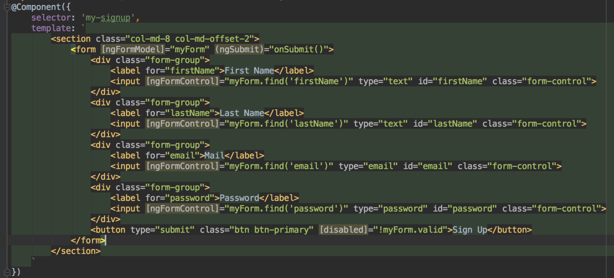
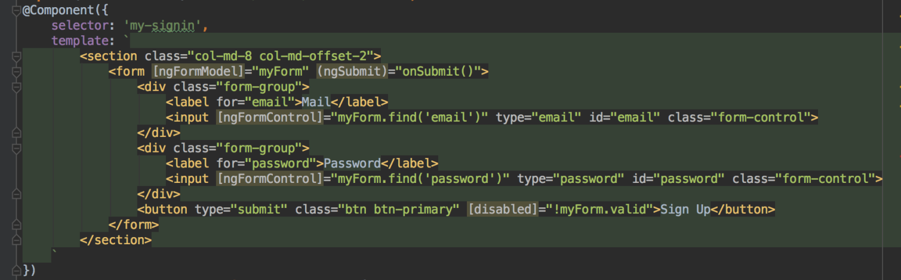
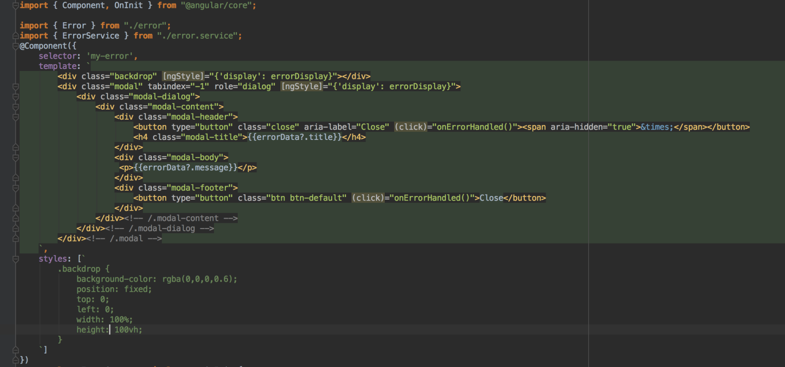

# CREATING A MEAN APPLICATION WITH AUTHENTICATION USING ANGULAR 2: Part 3

If you missed parts [1](./pages/mean_app_1) and [2](./pages/mean_app_2) of this tutorial, please go back and look at them first!

There are two major things left to finish this application: **Authentication** and **Error Handling**. Starting with authentication, let’s go back to the NodeJS server and in models, add a new file called **user.js:**

```
var mongoose = require('mongoose');
var Schema = mongoose.Schema;
var mongooseUniqueValidator = require('mongoose-unique-validator');

var schema = new Schema({
    firstName: {type: String, required: true},
    lastName: {type: String, required: true},
    password: {type: String, required: true},
    email: {type: String, required: true, unique: true},
    houses: [{type: Schema.Types.ObjectId, ref: 'house'}],
    bedrooms: [{type: Schema.Types.ObjectId, ref: 'bedroom'}]

});

schema.plugin(mongooseUniqueValidator);

module.exports = mongoose.model('User', schema);
```

Next let’s add routes for this file in **routes/users.js:**

```
var express = require('express');
var router = express.Router();
var passwordHash = require('password-hash');
var jwt = require('jsonwebtoken');

var User = require('../models/user');

router.post('/', function(req, res, next) {
    var user = new User({
        firstName: req.body.firstName,
        lastName: req.body.lastName,
        password: passwordHash.generate(req.body.password),
        email: req.body.email
    });
    user.save(function(err, result) {
        if (err) {
            return res.status(404).json({
                title: 'An error occurred',
                error: err
            });
        }
        res.status(200).json({
            message: 'Success',
            obj: result
        });
    });
});

router.post('/signin', function(req, res, next) {
    User.findOne({email: req.body.email}, function(err, doc) {
        if (err) {
            return res.status(404).json({
                title: 'An error occurred',
                error: err
            });
        }
        if (!doc) {
            return res.status(404).json({
                title: 'No user found',
                error: {message: 'User could not be found'}
            });
        }
        if (!passwordHash.verify(req.body.password, doc.password)) {
            return res.status(404).json({
                title: 'Could not sign you in',
                error: {message: 'Invalid password'}
            });
        }
        var token = jwt.sign({user: doc}, 'secret', {expiresIn: 7200});
        res.status(200).json({
            message: 'Success',
            token: token,
            userId: doc._id
        });
    })
});

module.exports = router;
```

Notice here we required two external plugins, *password-hash* and *json-web-token*. Make sure to run an `npm install` for each of these. PasswordHash is used to obfuscate the password for each user account in the database, and json web tokens are used to authenticate users. On signin, if a user is approved, a token is returned to the browser. We can then check for the token on the client side to determine whether a user is authenticated.

Now that we have configured users in the node side, after requiring the routes in app.js, we can turn our attention to the angular side. Within the assets/app folder, create a new folder called auth and a TypeScript file called **user.ts**:

```
export class User {
    constructor(public email: string, public password: string, public firstName?: string, public lastName?: string) {}
}
```
Here is the code for **auth/auth.service.ts**, which contains methods for signing up, logging in, and logging out, as well as a very important method that checks whether a user is currently logged in:

```
import { Injectable } from "@angular/core";
import { Http, Headers } from "@angular/http";
import { Observable } from "rxjs/Observable";
import 'rxjs/Rx';

import { User } from "./user";

@Injectable()
export class AuthService {
    constructor (private _http: Http) {}

    signup(user: User) {
        const body = JSON.stringify(user);
        const headers = new Headers({'Content-Type': 'application/json'});
        return this._http.post('http://localhost:3000/user', body, {headers: headers})
            .map(response => response.json())
            .catch(error => Observable.throw(error.json()));
    }

    signin(user: User) {
        const body = JSON.stringify(user);
        const headers = new Headers({'Content-Type': 'application/json'});
        return this._http.post('http://localhost:3000/user/signin', body, {headers: headers})
            .map(response => response.json())
            .catch(error => Observable.throw(error.json()));
    }

    logout() {
        localStorage.clear();
    }

    isLoggedIn() {
        return localStorage.getItem('token') !== null;
    }
}
```

Next we will add a **Sign Up** form. Below is the code for **auth/signup.component.ts:**

```
import { Component, OnInit } from "@angular/core";
import { FormBuilder, ControlGroup, Validators, Control } from "@angular/common";

import { User } from "./user";
import { AuthService } from "./auth.service";
```



```
export class SignupComponent implements OnInit {
    myForm: ControlGroup;

    constructor(private _fb:FormBuilder, private _authService: AuthService) {}

    onSubmit() {
        const user = new User(this.myForm.value.email, this.myForm.value.password, this.myForm.value.firstName, this.myForm.value.lastName);
        console.log(user);
        this._authService.signup(user)
            .subscribe(
                data => console.log(data),
                error => console.log(error)
            )
    }

    ngOnInit() {
        this.myForm = this._fb.group({
            firstName: ['', Validators.required],
            lastName: ['', Validators.required],
            email: ['', Validators.compose([
                Validators.required,
                this.isEmail
            ])],
            password: ['', Validators.required]
        });
    }

    private isEmail(control: Control): {[s: string]: boolean} {
        if (!control.value.match("[a-z0-9!#$%&'*+/=?^_`{|}~-]+(?:\.[a-z0-9!#$%&'*+/=?^_`{|}~-]+)*@(?:[a-z0-9](?:[a-z0-9-]*[a-z0-9])?\.)+[a-z0-9](?:[a-z0-9-]*[a-z0-9])?")) {
            return {invalidMail: true};
        }
    }
}
```

Some things worth noting: In the *isEmail()* method that complicated expression is a regex that ensures the text entered in the email textbox is in fact an email. In the *init()* method, the validators used are imported npm packages, not part of angular 2. Here is the code for the very similar **auth/signin.component.ts:**

```
import { Component, OnInit } from "@angular/core";
import { ControlGroup, FormBuilder, Validators, Control } from "@angular/common";
import { Router } from "@angular/router";

import { User } from "./user";
import { AuthService } from "./auth.service";


export class SigninComponent implements OnInit {
    myForm: ControlGroup;

    constructor(private _fb:FormBuilder, private _authService: AuthService, private _router: Router, private _errorService: ErrorService) {}

    onSubmit() {
        const user = new User(this.myForm.value.email, this.myForm.value.password);
        this._authService.signin(user)
            .subscribe(
                data => {
                    localStorage.setItem('token', data.token);
                    localStorage.setItem('userId', data.userId);
                    this._router.navigateByUrl('/');
                },
                error => console.log(error)
            );
    }

    ngOnInit() {
        this.myForm = this._fb.group({
            email: ['', Validators.compose([
                Validators.required,
                this.isEmail
            ])],
            password: ['', Validators.required]
        });
    }

    private isEmail(control: Control): {[s: string]: boolean} {
        if (!control.value.match("[a-z0-9!#$%&'*+/=?^_`{|}~-]+(?:\.[a-z0-9!#$%&'*+/=?^_`{|}~-]+)*@(?:[a-z0-9](?:[a-z0-9-]*[a-z0-9])?\.)+[a-z0-9](?:[a-z0-9-]*[a-z0-9])?")) {
            return {invalidMail: true};
        }
    }
}
```

Here is a service that very simply logs out the user using the pre-existing auth.service logout method. It is called **auth/logout.component.ts:**



And lastly, the component which puts together all the other auth ones, **authentication.component.ts:**


At this point, authentication works. All we have to do is add an error handling aspect. In your assets/app folder add a new folder called errors and create a file called **error.ts:**
 

```
export class Error {
    constructor(public title: string, public message: string) {}
}
```

Now, add an **error.service.ts:**

```
import { EventEmitter } from "@angular/core";

import { Error } from "./error";

export class ErrorService {
    errorOccurred = new EventEmitter();

    handleError(error: any) {
        const errorData = new Error(error.title, error.message);
        this.errorOccurred.emit(errorData);
    }
}
```

And finally, **error.component.ts!**




Just update your app.component.ts to include <my-error></my-error> after the last div in the template, change all the subscribe method errors to call the errorService *handleError() *method, and you have completed this MEAN stack tutorial with angular 2! Please post any problems in the comments below. Full code can be found at **https://github.com/neelkrishna/mean-house.git!**