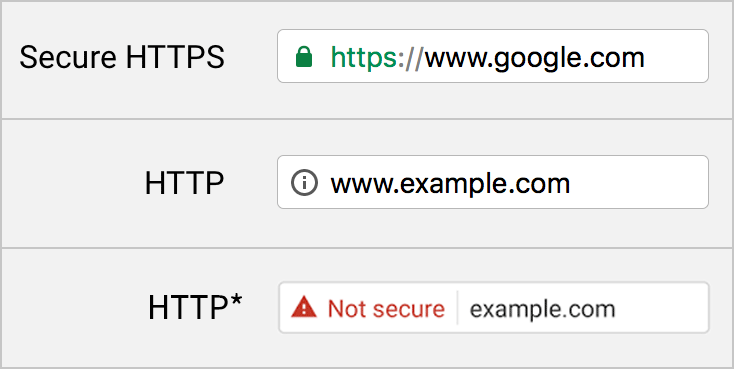
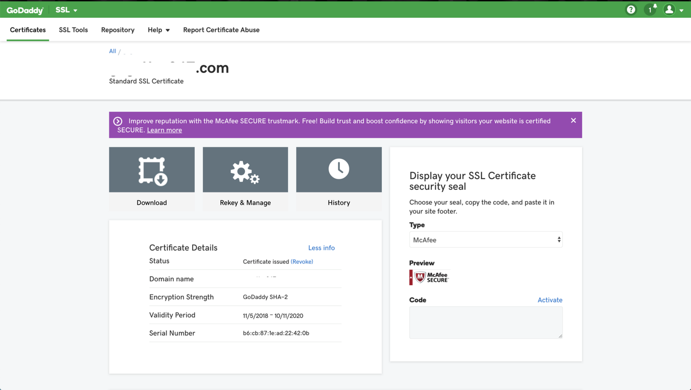

# How to Get Rid of That Pesky "Not Secure" Tag on Your Web Application




Recently, I was tasked with securing an app I am working on with an SSL certificate purchased from [GoDaddy](http://godaddy.com/). I found several tutorials explaining how to install the certificate on my Spring Server, and the solutions were seemingly very simple. All I had to do was use keytool or a similar utility to generate a keystore using my certificate and key, and then add a path to the keystore (stored in the src/main/resources folder) to the application.properties file as such:

> server.ssl.key-store-type=PKCS12  
server.ssl.key-store=classpath:keystore.p12  
server.ssl.key-store-password=password  
server.ssl.key-alias=tomcat

However, when I tried to connect to the supposedly secured server with postman or my Angular app, it would give me the error _“unable to connect over https”._

I decided to take a different approach.  Because my server and client applications are hosted on the same instance, I realized I didn’t have to secure communication between these two applications with an SSL certificate.  Instead, I had to focus on secturing communication between each user’s browser and the front end client app.

After a lot of trial and error, I found a way to secure my site, all from the Nginx webserver config on AWS, which I use to serve up the Angular app. This involves serving up your SSL certificate and key along with the app through Nginx, so when users access your app, their browsers pull in the certificate as well.

This tutorial uses Nginx on an Ubuntu instance.  If you need help installing Nginx, you can find it [here.](https://www.digitalocean.com/community/tutorials/how-to-install-nginx-on-ubuntu-16-04)

Once you install Nginx, access the configuration file, which can be found at

> /etc/nginx/conf.d/default.conf

First, add a server configuration for port 80, the port which is hit when the server is hit without a port specification. The only purpose of this is to redirect all requests to port 443, which is the default port for secure requests. You can do this as such:

```
server{
    listen 80;
    return 301 https://$host$request_uri;
}
```

Then, we have to add config at port 443 as well (all in the same default.conf file):

```
server{
    listen 80;
    return 301 https://$host$request_uri;
}

server {
    listen       443;
    server_name  _;
    ssl on;
}
```

From here, you need access to your certificate. If you purchased your SSL certificate from GoDaddy, steps are below. If not, find a way to download:

>1. Your certificate
2. The chained (root) certificates
3. The key to the certificate

To download your certificate from GoDaddy, go to “manage my certificates” from the homepage. From there, you will see this page:



Click on “Download” and select the type “Tomcat”. Three files will be downloaded as a zip. Extract them, and you will see two .crt files and a .pem file. One of the .crt files will have the word “bundle”, meaning it is the root chain of certificates. Open both .crt files in a text editor and you’ll see that the “bundle” file has multiple certificates and the other file only has one and is your intermediate certificate.

You need to concatenate the two files by adding your certificate to the chain of certificates, right at the top. At the end you should have a .crt file with a chain of certificates, starting with your intermediate certificates and followed by the entire chain of root certificates, as such:

```
-----BEGIN CERTIFICATE-----
YOUR Certificate, the one that was in a separate .crt file
-----END CERTIFICATE-----
//paste the entirety of the"bundle" file below as-is
-----BEGIN CERTIFICATE-----
Chain
-----END CERTIFICATE-----
-----BEGIN CERTIFICATE-----
ChainedCertContinued
-----END CERTIFICATE-----
-----BEGIN CERTIFICATE-----
YetAnotherChainedCert
-----END CERTIFICATE-----
```
At this point, you should have a new .crt file that looks like the one above with the aforementioned combination of certificates, and a .key file that is the private key to the certificate.  Transfer both files to your EC2 instance and store them in an arbitrary location. Then, add these two files to your default.conf’s port 443 configuration, as such:

```
server{
    listen 80;
    return 301 https://$host$request_uri;
}

server {
    listen       443;
    server_name  _;
    ssl on;

    ssl_certificate /absolute/path/to/your/certificate.crt;
    ssl_certificate_key /absolute/path/to/your/key.key;
}
```
Additionally, add some SSL config to the port 443 config to allow your certificates to play nicely with Nginx.  After adding these, default.conf should look like this:

```
server{
    listen 80;
    return 301 https://$host$request_uri;
}

server {
    listen       443;
    server_name  _;
    ssl on;

    ssl_certificate /absolute/path/to/your/certificate.crt;
    ssl_certificate_key /absolute/path/to/your/key.key;

    ssl_protocols TLSv1 TLSv1.1 TLSv1.2;
    ssl_prefer_server_ciphers on;
    ssl_ciphers 'EECDH+AESGCM:EDH+AESGCM:AES256+EECDH:AES256+EDH';

    #charset koi8-r;
    access_log  /var/log/nginx/access.log  main;
}
```

Now, direct the port config to the folder of static files you want Nginx to serve by adding the “root” keyword.  This is best as an absolute path.  Also, add the index files with keyword “index”.

```
server{
    listen 80;
    return 301 https://$host$request_uri;
}

server {
    listen       443;
    server_name  _;
    ssl on;

    ssl_certificate /absolute/path/to/your/certificate.crt;
    ssl_certificate_key /absolute/path/to/your/key.key;

    ssl_protocols TLSv1 TLSv1.1 TLSv1.2;
    ssl_prefer_server_ciphers on;
    ssl_ciphers 'EECDH+AESGCM:EDH+AESGCM:AES256+EECDH:AES256+EDH';

    #charset koi8-r;
    access_log  /var/log/nginx/access.log  main;

    root   /path/to/your/build/folder;
    index  index.html index.htm;
}
```

Now, we have to set up a reverse proxy to redirect HTTPS back to HTTP.  This will convert your HTTPS request from the browser app to HTTP because HTTPS is no longer required when the two apps are on the same instance.

To do this, we’ll add a “location” block to the default.conf file.  Set the location to the root path to all backend endpoints, so that any requests to those endpoints will be affected by the content of the location block.  Then, inside the block, we set “proxy_pass” to your instance’s IP address and port over HTTP, as shown below. Additionally, add a blank location block for all other requests to proceed as usual.

```
server{
    listen 80;
    return 301 https://$host$request_uri;
}

server {
    listen       443;
    server_name  _;
    ssl on;

    ssl_certificate /absolute/path/to/your/certificate.crt;
    ssl_certificate_key /absolute/path/to/your/key.key;

    ssl_protocols TLSv1 TLSv1.1 TLSv1.2;
    ssl_prefer_server_ciphers on;
    ssl_ciphers 'EECDH+AESGCM:EDH+AESGCM:AES256+EECDH:AES256+EDH';

    #charset koi8-r;
    access_log  /var/log/nginx/access.log  main;

    root   /path/to/your/build/folder;
    index  index.html index.htm;

    location / {

    }

    location /backend/server/endpoints/... {
        proxy_pass [http://server.instance.ip.address:port;](http://18.221.84.209:9090;/)
        proxy_set_header HOST $host:$server_port;
        proxy_set_header X-Real-IP $remote_addr;
        proxy_set_header X-Forwarded-For $proxy_add_x_forwarded_for;
    }
}
```

Lastly, we need to add an error page, which is already built and stored in an Nginx folder. Simply paste in this code:

```
server{
    listen 80;
    return 301 https://$host$request_uri;
}

server {
    listen       443;
    server_name  _;
    ssl on;

    ssl_certificate /absolute/path/to/your/certificate.crt;
    ssl_certificate_key /absolute/path/to/your/key.key;

    ssl_protocols TLSv1 TLSv1.1 TLSv1.2;
    ssl_prefer_server_ciphers on;
    ssl_ciphers 'EECDH+AESGCM:EDH+AESGCM:AES256+EECDH:AES256+EDH';

    #charset koi8-r;
    access_log  /var/log/nginx/access.log  main;

    root   /path/to/your/build/folder;
    index  index.html index.htm;

    location / {

    }

    location /gogetter/api {
        proxy_pass [http://server.instance.ip.address:port;](http://18.221.84.209:9090;/)
        proxy_set_header HOST $host:$server_port;
        proxy_set_header X-Real-IP $remote_addr;
        proxy_set_header X-Forwarded-For $proxy_add_x_forwarded_for;
    }

    error_page   500 502 503 504  /50x.html;
    location = /50x.html {
        root   /usr/share/nginx/html;
    }
}
```

From here, you should be able to hit your server after changing any and all REST requests to https. The reverse proxy will automatically redirect the requests to HTTP so your server will not have to be updated at all. Happy coding!